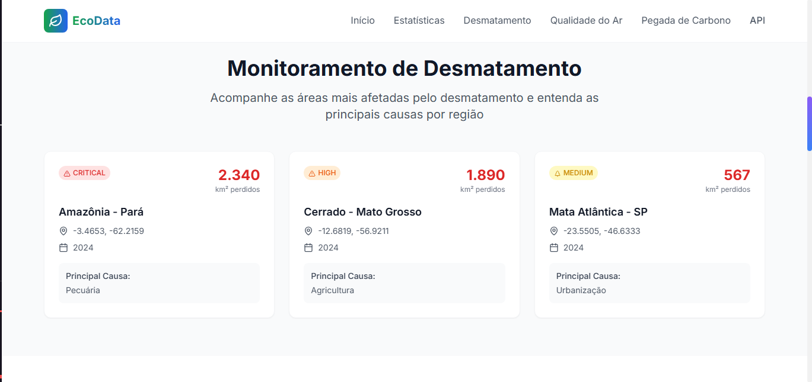
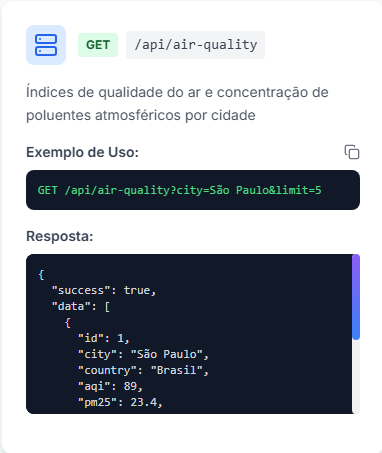
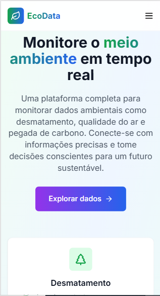
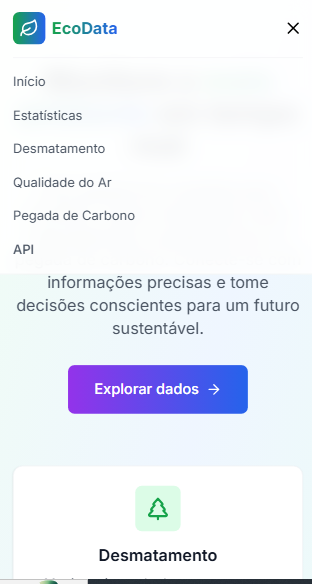

# 🌱 EcoData Landing Page

Uma landing page moderna e responsiva desenvolvida com Next.js, React, TypeScript e TailwindCSS que consome a **API de Dados Ambientais** do Mini Projeto M4, apresentando informações sobre desmatamento, qualidade do ar e pegada de carbono de forma visualmente atrativa e interativa.

## 📋 Sobre o Projeto

Este projeto foi desenvolvido como parte do **Mini Projeto do Módulo 5** do curso, com foco na criação de uma interface moderna que consome dados de uma API REST ambiental. A landing page apresenta informações sobre questões ambientais críticas de forma visualmente atrativa e responsiva.

### 🎯 Problema Resolvido

A API consumida resolve problemas relacionados ao **monitoramento ambiental**, permitindo que usuários e organizações:

- 🌳 **Monitorem desmatamento** - Acompanhem áreas afetadas por região com dados geográficos
- 🌬️ **Analisem qualidade do ar** - Verifiquem índices de poluição atmosférica em tempo real  
- 🏭 **Calculem pegada de carbono** - Identifiquem emissões de CO2 por setor e país
- 📊 **Tomem decisões conscientes** - Baseiem ações em dados ambientais precisos
- 🌍 **Promovam sustentabilidade** - Identifiquem oportunidades de melhoria ambiental

## 🛠️ Tecnologias Utilizadas

| Tecnologia | Versão | Descrição |
|------------|--------|-----------|
| **Next.js** | 14.2.5 | Framework React para produção com App Router |
| **React** | 18.2.0 | Biblioteca para construção de interfaces de usuário |
| **TypeScript** | 5.2.2 | Superset JavaScript com tipagem estática |
| **TailwindCSS** | 3.3.5 | Framework CSS utilitário para estilização |
| **Lucide React** | 0.294.0 | Biblioteca de ícones SVG otimizados |
| **PostCSS** | 8.4.31 | Ferramenta para transformação CSS |
| **ESLint** | 8.51.0 | Linter para JavaScript/TypeScript |

## 🎨 Funcionalidades

- ✅ **Design Responsivo** - Adaptável a diferentes tamanhos de tela (mobile, tablet, desktop)
- ✅ **Animações Suaves** - Efeitos de fade-in, hover, focus e transições CSS
- ✅ **Navegação por Scroll** - Menu fixo com scroll suave entre seções
- ✅ **Consumo de API** - Integração com 3+ rotas GET da API Ambiental
- ✅ **Componentização** - Arquitetura modular e reutilizável
- ✅ **Tipagem TypeScript** - Código type-safe e bem documentado
- ✅ **Estados de Loading** - Feedback visual durante carregamento de dados
- ✅ **Tratamento de Erros** - Mensagens de erro amigáveis com retry
- ✅ **Performance Otimizada** - Carregamento eficiente e lazy loading
- ✅ **Dados Ambientais** - Visualização interativa de métricas ambientais

## 📱 Estrutura da Landing Page

### 🏠 Seções Implementadas

1. **Header** - Navegação fixa com menu responsivo e logo EcoData
2. **Hero Section** - Apresentação principal com foco em sustentabilidade
3. **Stats Section** - Estatísticas ambientais em tempo real
4. **Deforestation Section** - Dados de desmatamento por região com severidade
5. **Air Quality Section** - Índices de qualidade do ar e poluentes
6. **Carbon Footprint Section** - Emissões de CO2 por setor com potencial de redução
7. **API Section** - Documentação interativa da API de Dados Ambientais
8. **Footer** - Informações de contato e links para a API

### 🔌 Rotas da API Consumidas

- `GET /api/deforestation` - Dados de desmatamento com coordenadas e severidade
- `GET /api/air-quality` - Índices de qualidade do ar e poluentes atmosféricos
- `GET /api/carbon-footprint` - Emissões de CO2 por setor com análise de redução

## 🚀 Como Executar o Projeto

### 📋 Pré-requisitos

- **Node.js** 18+ instalado ([Download](https://nodejs.org/))
- **npm** ou **yarn** como gerenciador de pacotes
- **Git** para controle de versão
- **API do M4** rodando (veja link do repositório abaixo)

### ⚙️ Instalação

1. **Clone o repositório:**
\`\`\`bash
git clone https://github.com/seu-usuario/ecodata-landing.git
cd ecodata-landing
\`\`\`

2. **Instale as dependências:**
\`\`\`bash
npm install
# ou
yarn install
\`\`\`

3. **Configure a URL da API:**
   - Abra o arquivo `app/page.tsx`
   - Altere a variável `API_BASE_URL` para a URL da sua API do M4
   - Exemplo: `const API_BASE_URL = "http://localhost:3000"` (se local)

4. **Execute o projeto em modo de desenvolvimento:**
\`\`\`bash
npm run dev
# ou
yarn dev
\`\`\`

5. **Abra no navegador:**
   - Acesse [http://localhost:3000](http://localhost:3000)

### 🏗️ Build para Produção

\`\`\`bash
# Gerar build otimizado
npm run build

# Executar em produção
npm start

# ou com yarn
yarn build
yarn start
\`\`\`

## 🔗 Links Relacionados

- **🔌 API Utilizada:** [API de Dados Ambientais - Mini Projeto M4](https://github.com/kauecalixto/mini_projeto_m4)

## 📸 Screenshots

### 🖥️ Desktop

*Seção Hero com foco em sustentabilidade*

*Estatísticas ambientais em tempo real*

*Monitoramento de desmatamento por região*

*Índices de qualidade do ar por cidade*

### 📱 Mobile

*Layout responsivo da seção hero*

*Menu mobile com navegação suave*

## 🏗️ Arquitetura do Projeto

\`\`\`
ecodata-landing/
├── app/
│   ├── globals.css            # Estilos globais e animações
│   ├── layout.tsx             # Layout raiz da aplicação
│   └── page.tsx               # Página principal (Landing Page)
├── components/                 # Componentes React
│   ├── button.tsx             # Componente de botão customizado
│   ├── card.tsx               # Componente de card reutilizável
│   ├── error-message.tsx      # Componente de erro
│   ├── footer.tsx             # Rodapé da aplicação
│   ├── header.tsx             # Cabeçalho com navegação
│   ├── hero-section.tsx       # Seção hero principal
│   ├── loading-spinner.tsx    # Componente de loading
│   ├── stats-section.tsx      # Seção de estatísticas ambientais
│   ├── deforestation-section.tsx    # Seção de desmatamento
│   ├── air-quality-section.tsx      # Seção de qualidade do ar
│   ├── carbon-footprint-section.tsx # Seção de pegada de carbono
│   └── api-section.tsx        # Seção de documentação da API
├── docs/
│   └── images/                # Screenshots do projeto
├── public/                    # Arquivos estáticos
├── README.md                  # Documentação principal
├── next.config.mjs           # Configuração do Next.js
├── package.json              # Dependências e scripts
├── tailwind.config.ts        # Configuração do TailwindCSS
├── tsconfig.json             # Configuração do TypeScript
└── postcss.config.js         # Configuração do PostCSS
\`\`\`

## 🌍 Dados Ambientais Monitorados

### 🌳 Desmatamento
- **Regiões afetadas** com coordenadas geográficas
- **Área perdida** em km² por ano
- **Principais causas** (pecuária, agricultura, urbanização)
- **Níveis de severidade** (baixo, médio, alto, crítico)

### 🌬️ Qualidade do Ar
- **Índice de Qualidade do Ar (IQA)** por cidade
- **Poluentes atmosféricos** (PM2.5, PM10, CO, NO2, O3, SO2)
- **Status de qualidade** (bom, moderado, insalubre, perigoso)
- **Monitoramento em tempo real** com timestamps

### 🏭 Pegada de Carbono
- **Emissões de CO2** por setor (transporte, energia, indústria)
- **Análise por país** e tipo de emissão
- **Potencial de redução** em percentual
- **Tendências anuais** e oportunidades de melhoria

## 🤝 Contribuição

Contribuições são bem-vindas! Para contribuir:

1. Faça um fork do projeto
2. Crie uma branch para sua feature (\`git checkout -b feature/AmazingFeature\`)
3. Commit suas mudanças (\`git commit -m 'feat: add some AmazingFeature'\`)
4. Push para a branch (\`git push origin feature/AmazingFeature\`)
5. Abra um Pull Request

### 📝 Padrão de Commits

Este projeto utiliza [Conventional Commits](https://www.conventionalcommits.org/):

- \`feat:\` - Nova funcionalidade
- \`fix:\` - Correção de bug
- \`docs:\` - Documentação
- \`style:\` - Formatação, estilos CSS
- \`refactor:\` - Refatoração de código
- \`perf:\` - Melhoria de performance
- \`test:\` - Adição de testes
- \`chore:\` - Tarefas de build/configuração

## 📊 Métricas do Projeto

- **Componentes:** 12+ componentes reutilizáveis
- **Rotas de API:** 3 endpoints ambientais
- **Responsividade:** 3 breakpoints (mobile, tablet, desktop)
- **Animações:** 8+ efeitos visuais customizados
- **TypeScript:** 100% tipado
- **Performance:** Otimizado para Core Web Vitals

## 🌱 Impacto Ambiental

Este projeto contribui para a **conscientização ambiental** ao:

- 📈 **Visualizar dados críticos** sobre desmatamento e poluição
- 🎯 **Identificar áreas prioritárias** para ação ambiental
- 📊 **Facilitar tomada de decisões** baseada em dados
- 🌍 **Promover transparência** em questões ambientais
- 💡 **Educar sobre sustentabilidade** através de dados visuais

## 📄 Licença

Este projeto está sob a licença MIT. Veja o arquivo [LICENSE](LICENSE) para mais detalhes.

## 👨‍💻 Autor

**[Seu Nome]**
- GitHub: [@seu-usuario](https://github.com/kauecalixto)
- LinkedIn: [Seu Nome](https://www.linkedin.com/in/kauescalixto/)

---

⭐ **Se este projeto te ajudou, deixe uma estrela no repositório!**

🌱 **Juntos por um futuro mais sustentável!**

Desenvolvido com ❤️ e 🌍 por KauêCalixto | © 2025 EcoData
